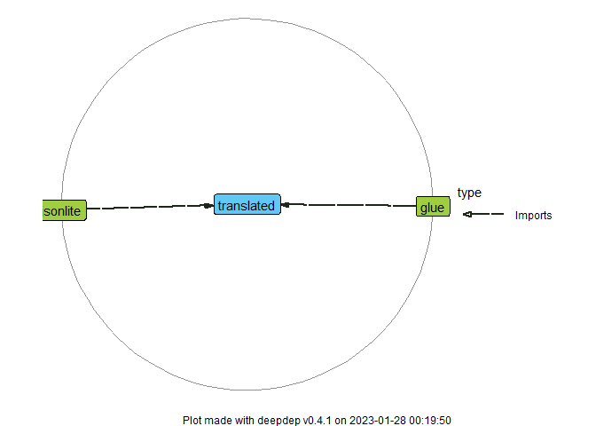

<!-- README.md is generated from README.Rmd. Please edit that file -->

# translated

<!-- badges: start -->

[](https://lifecycle.r-lib.org/articles/stages.html#experimental)
[](https://CRAN.R-project.org/package=translated)
<!-- badges: end -->

{translated} is a complex translation system made easy. Provide a
directory where translation JSON files are stored and access entries
from any place in your code. Various features are incorporated:
recursive string interpolation, custom plural form rules, entry
grouping, inheriting translation data from other dialects (see
[differences between British and American
English](https://en.wikipedia.org/wiki/Comparison_of_American_and_British_English)
for a canonical example), and more.

## Installation

You can install the development version of {translated} from
[GitHub](https://github.com/) with:

``` r
# install.packages("devtools")
devtools::install_github("ttscience/translated")
```

## How to use

To start using {translated} in your project, specify where to find
translation JSON files:

``` r
library(translated)
# Below is the path to examples shipped with this package
path <- system.file("examples", package = "translated")
trans_path(path)
```

### Basic usage

Processing translation data is done behind the curtains. The user can
focus on using the entries:

``` r
trans("title")
#> [1] "Predefined number generator"
```

This was the translation for the default locale, i.e. `en_US` (United
States English). The currently set locale can be checked with:

``` r
trans_locale()
#> [1] "en_US"
```

To set a different locale (e.g. `pl_PL` or `pl` for short, my native
language), simply pass it as an argument to the same function. Both
mentioned forms are acceptable (plus the form with encoding included,
for example `pl_PL.UTF-8`), so we’ll use the simpler one:

``` r
trans_locale("pl")
```

The translation immediately changes:

``` r
trans("title")
#> [1] "Generator liczb predefiniowanych"
```

### String interpolation

Some translations can have gaps to fill with variable values. They are
denoted with braces `{}` inside translation text,
e.g. `"Courtney is {age} years old."`. Pass these variables as named
parameters to `trans()` function (and don’t worry, unused parameters are
ignored). Most often they’ll be strings, but anything coercible to
string is valid, especially numbers:

``` r
trans("btn_insert", number = 4)
#> [1] "Wstaw 4"
```

### Plural forms

It is up to the user to provide singular and plural forms for each entry
where it’s necessary. {translated} provides the user with an easy method
to make it work: all forms for an entry are stored in a list. With an
appropriate number-to-form converter, the user only has to supply the
number as `.n` parameter:

``` r
trans("nouns.cat", .n = 5)
#> [1] "5 kotów"
trans("nouns.cat", .n = 1)
#> [1] "1 kot"
```

### Other features

To see more details about what is possible, see the vignettes.

## Dependency graph

{translated} is meant to be lightweight, so only the key packages are
imported:


