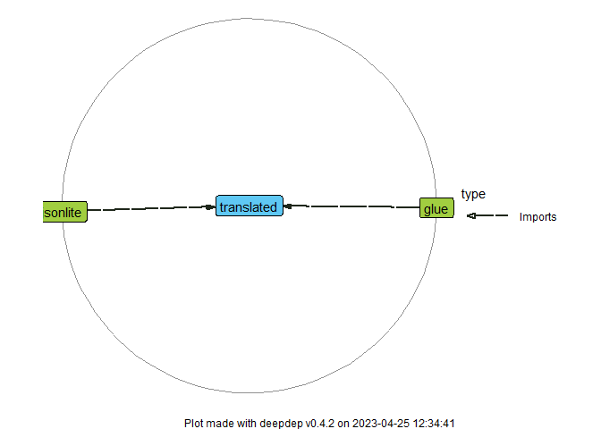

<!-- README.md is generated from README.Rmd. Please edit that file -->

# translated

<!-- badges: start -->

[](https://lifecycle.r-lib.org/articles/stages.html#stable)
[](https://CRAN.R-project.org/package=translated)
[](https://github.com/ttscience/translated/actions)
[](https://app.codecov.io/gh/ttscience/translated?branch=master)
<!-- badges: end -->

{translated} is a complex internationalization system made easy. Provide
a directory where localization JSON files are stored and access entries
from any place in your code. Various features are incorporated:
recursive string interpolation, custom plural form rules, entry
grouping, inheriting localization data from other dialects (see
[differences between British and American
English](https://en.wikipedia.org/wiki/Comparison_of_American_and_British_English)
for a canonical example), and more.

## Installation

``` r
# Install from CRAN:
install.packages("translated")

# Install development version from GitHub:
# install.packages("devtools")
devtools::install_github("ttscience/translated")
```

## How to use

To start using {translated} in your project, specify where to find
localization JSON files:

``` r
library(translated)
# Below is the path to examples shipped with this package
path <- system.file("examples", package = "translated")
trans_path(path)
```

### Basic usage

Processing localization data is done behind the curtains. The user can
focus on using the entries:

``` r
trans("title")
#> [1] "Predefined number generator"
```

This was the localization for the default locale, i.e. `en_US` (United
States English). The currently set locale can be checked with:

``` r
trans_locale()
#> [1] "en_US"
```

To set a different locale (e.g. `pl_PL` or `pl` for short, my native
language), simply pass it as an argument to the same function. Both
mentioned forms are acceptable (plus the form with encoding included,
for example `pl_PL.UTF-8`), so we’ll use the simpler one:

``` r
trans_locale("pl")
```

The localization immediately changes:

``` r
trans("title")
#> [1] "Generator liczb predefiniowanych"
```

To list all currently available locales, call:

``` r
trans_available()
#> [1] "en_UK" "en_US" "pl"
```

### Localizing multiple strings

If more than one key is supplied, an equal amount of translations is
returned. It makes it easier to translate vectors of strings,
e.g. column names. Works with all other features, too.

``` r
trans(c("btn_close", "title"))
#> [1] "Zamknij"                          "Generator liczb predefiniowanych"
```

### String interpolation

Some entries can have gaps to fill with variable values. They are
denoted with braces `{}` inside translation text,
e.g. `"Courtney is {age} years old."`. Pass these variables as named
parameters to `trans()` function (and don’t worry, unused parameters are
ignored). Most often they’ll be strings, but anything coercible to
string is valid, especially numbers:

    # JSON entry
    "btn_insert": "Wstaw {number}"

``` r
trans("btn_insert", number = 4)
#> [1] "Wstaw 4"
```

### Plural forms

It is up to the user to provide singular and plural forms for each entry
where it’s necessary. {translated} provides the user with an easy method
to make it work: all forms for an entry are stored in a list. With an
appropriate number-to-form converter, the user only has to supply the
number as `.n` parameter.

To see details on defining rules of plural forms, see [“Plurality rule
definition” section](#Plurality%20rule%20definition).

    # JSON entry
    "cat": ["brak kotów", "{.n} kot", "{.n} koty", "{.n} kotów"]

``` r
trans("cat", .n = 5)
#> [1] "5 kotów"
trans("cat", .n = 1)
#> [1] "1 kot"
```

### Entry grouping

It can be difficult to keep track of all the entries in a large JSON
file, so a grouping system comes in handy. Say, for example, that you’d
created a large Shiny app with multiple modules and now you’d want it
internationalized. You’d group your localization entries by module so
that you find entries quicker and don’t have to worry about name
clashes.

To access an entry within a group, use a `"group.key"` string with dots
dividing parts of the path. There is no limit to how deep the grouping
may go, so the key may as well look like `"group1.group2.group3.key"`.

And remember – *never* use a key with a dot, as the interpreter cannot
distinguish between the two. But the easy grouping functionality is
worth this slight inconvenience.

    # JSON entry
    "nouns": {
      "behavior": "zachowanie"
    }

``` r
trans("nouns.behavior")
#> [1] "zachowanie"
```

### Nested translations

As it turns out, [{glue}](https://github.com/tidyverse/glue) package
offers much more flexibility than just inserting predefined variables –
it can execute arbitrary code too. This isn’t too helpful on its own;
you may as well pass the result of this code as a named parameter to
`trans()` function. However, this has an interesting effect regarding
nested translations.

See, it’s a common problem that a phrase may contain more than one noun
dependent on its count. You may try to cover all possible cases, but
their number grows exponentially. What you can do instead is to split
the processing logic between multiple entries, each having one
count-dependent part at most, then compound these entries using
`trans()` function inside another entry. See the example below; however,
note that this is just one of the possible solutions, perhaps not even
optimal.

    # JSON entry
    "result": "Przeskanowałam {trans('file', .n = n_files)} w {trans('dir', .n = n_dirs)}.",
    "file": ["{.n} plików", "{.n} plik", "{.n} pliki", "{.n} plików"],
    "dir": ["żadnym folderze", "{.n} folderze", "{.n} folderach", "{.n} folderach"]

``` r
trans("result", n_files = 4, n_dirs = 1)
#> [1] "Przeskanowałam 4 pliki w 1 folderze."
```

### Other features

If you have an idea for a feature that is missing from {translated},
please start an issue on our GitHub repository. Pull requests are
obviously welcome as well.

## JSON file structure

Localization is to be stored in JSON files, all inside one folder. Each
JSON may only hold data for one language [^1], yet more than one JSON
may be used for a language [^2]. Files do not have to be in the same
folder, subdirectories are allowed (so the user may store all data for a
language in its own folder, for example).

Each JSON identifies its belonging by a required component: `locale`
stored under `config`. The other required component is `translation`
map, although there is no limit to how many entries there must be.
Furthermore, each locale should contain plurality case assignment as
`plural` stored under `config`, although only one file per locale must
contain it.

There are two optional `config` fields and both do not need to be
repeated as well: `inherit` and `default`. The former enables inheriting
translation and plurality data from other locales, making it easier to
translate dialectal differences. The latter sets the locale as the
default for its language (e.g. in the example below, American English is
used as the default version of English).

To sum it up, an example JSON structure is shown below:

    {
      "config": {
        "locale": "en_US",
        "plural": "n == 0 ~ 1, n == 1 ~ 2, TRUE ~ 3",
        "inherit": "en_UK",
        "default": true
      },
      "translation": {
        "key": "value",
        "plural_key": ["case_1", "case_2", "case_3"],
        "group": {
          "key2": "value2"
        }
      }
    }

### Plurality rule definition

A plurality rule consists of a set of sequentially-evaluated cases. They
are separated by commas (`,`). Each rule has two components: condition
and value. Should the condition evaluate to `TRUE`, its value is
returned, else the next rule is tested.

Values are placed to the right of their conditions, separated by a tilde
(`~`), meaning that conditions should not use tilde in their code. This
should not be a problem, however, as only a few simple operations should
suffice to create an appropriate set of rules for any language.

A condition has access to one variable: `n`. This is the count that
influences the phrase form. After evaluation, a condition should return
a single logical value, either `TRUE` or `FALSE`.

Now that we’ve discussed rule structure, let’s break down two examples,
starting with the one from above JSON:

`"n == 0 ~ 1, n == 1 ~ 2, TRUE ~ 3"`

There are three cases in this example. The first case matches if `n` is
equal to 0, returning 1. The second matches with 1 (for a singular
form), returning 2. The last case is a “catch-all”, returning 3 for all
inputs that did not match previous cases (i.e. any number other than 0
or 1).

Analogous rule for Polish is much more complicated:

`"n == 0 ~ 1, n == 1 ~ 2, n %% 100 %in% 12:14 ~ 4, n %% 10 %in% 2:4 ~ 3, TRUE ~ 4"`

Oof, this is more than double the length of English rule. But it’s not
that difficult in its essence.

First two cases are already known to you, they match 0s and 1s. There’s
also a “catch-all” at the end, returning 4. And the part inbetween? It
returns 3 for all numbers returning 2, 3 or 4 modulo 10 *except* [^3]
numbers that return 12, 13 or 14 modulo 100. That modulo operator `%%`
and inclusion operator `%is%` are the other two key operations.

Of course, any logical operator could be applied as well, so instead of
writing

`n %% 100 %in% 12:14 ~ 4, n %% 10 %in% 2:4 ~ 3`,

one could write

`(n %% 10 %in% 2:4) && !(n %% 100 %in% 12:14) ~ 3`.

However, it is best to stick to the simplest statements possible.

## Dependency graph

{translated} is meant to be lightweight, so only the key packages are
imported:



[^1]: Storing data in separate files for each language is in line with
    best practices. Usually there’ll be a different translator assigned
    for each language and having the data split between files gets rid
    of the need for merging files.

[^2]: Especially valuable in huge projects with a lot of text, as it
    enables grouping data in files by topic or module.

[^3]: “Except” means that the following case should precede the previous
    one.
